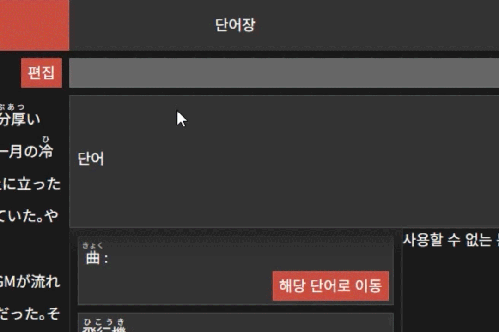
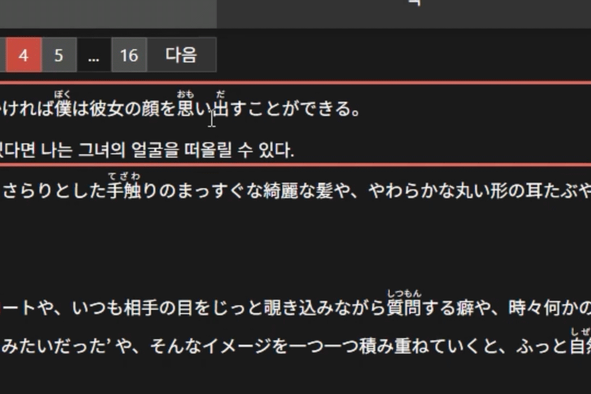
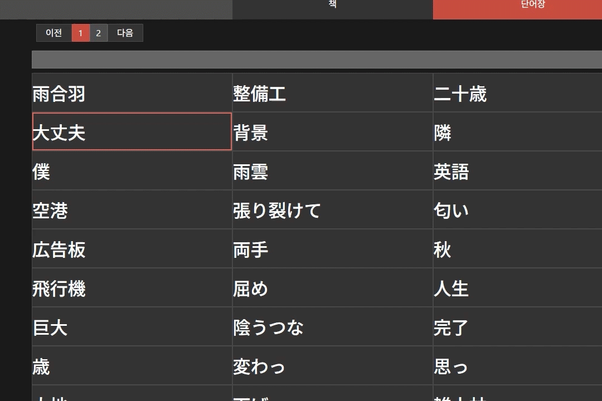

# OxxO

> [!WARNING]
> 現在、日本語への対応はできておりません。近いうちに対応できるようにしますので、お待たせいただきます。ご了承お願い申し上げます。

[한국어](README.md) | 日本語

 
 

## 開発環境

- Front-end : React, Typescript
- back-end : NodeJS, Express.js
- DB : Oracle

## 参照

- JamesKyburz/youtube-audio-stream
- @distube/ytdl-core
- toss/es-hangul

# プロジェクト紹介

日本語翻訳を楽しめる人のためのウェブアプリケーション。

## 開発の背景

日本語を翻訳することに、既存の文章作成プログラムでは物足りなさを感じ、満たすために開発を始めました。

基本的な翻訳文を管理する事と、単語をデーターベースに保存して活用する機能を追加。

最初は個人的使用を目的として開発いたしましたが、共同作業ができるようにプロジェクトを修正しています。

## 重要機能

日本語話者にもお役に立てれると思う所のみ紹介いたします。ご了承お願い申し上げます。

### 共通

#### 単語

文章をドラッグして単語を登録することができます。現在**漢字**や**漢字と平仮名**の組み合わせのみ登録ができます。

読み方は平仮名にして入力が望まれます。

一回単語を登録した場合、便利に追加する機能があります。詳細は機能紹介でご確認お願いします。

### 本

> [!NOTE]
> 携帯画面とタブレット画面に対応できます。表示されてるレイアウトには違いがある可能性があります。

原文（日本語文章）を登録して翻訳することができます。

登録された単語をまとめて見れる単語帳ページがあります。

> 近いうちに pdf で書き出し機能などを念頭に入れおります。

### ユーチューブ (Youtube)

ユーチューブリンクを通じて翻訳することができます。

> [!NOTE]
> 現在ユーチューブ翻訳は PC 画面のみ対応しております。また、充分な画面の高さが要ります。

シークェンスを追加してタイムラインを作成します。

音声がでる部分をドラッグして原文を登録します。後にもタイミングの修正はできます。

> オーディオ波形を読み込めない場合、**適当な波形**が表示されます。

> タイムラインを書き出す機能への支援を念頭に置いております。JSON 形式に保存されており、PremierePro から読み込む script や mogrt の表現式は別のレポジトリーから公開する予定です。

> ユーチューブ字幕に使われる形式への書き出し機能も支援する予定です。

## その他の機能

### 文章を mogrt 形式に書き出し機能

> [!IMPORTANT]
> ユーチューブから使用可能であり、文章の中の全ての単語が登録されたら円滑に作動します。

Adobe PremierePro の mogrt(モーショングラフィックステンプレート)ファイルで作動を念頭に入れて作られた機能であります。原文と振り仮名の文字列を書き出します。

近いうちに配布予定である mogrt ファイルに入力すると、振り仮名が該当する漢字の上に表視されます。

> [!CAUTION]
> 全角空白が漢字一文字のサイズと一致しているフォントにて、望む通りに表示できます。

# 機能紹介

## 単語の登録について

### 単語を新しく登録

単語をドラッグしてから読み方を入力して登録します。テキスト入力項目は該当する漢字の上に順番に表示されており、送り仮名を除いた部分の入力が望まれます。

## 既に登録された単語がある場合

該当する本に同じ表記で登録された単語がある場合、便利に追加できます。

## 登録された単語をドラッグしてから登録

登録された単語の表記全てが含まれた文章が検索にかかります。該当する文章に移動し確認をしたり、直ちに追加ができます。

## 本

### 文章編集

本に入る文章を入力することができます。文章入力と、段落の結合と分割が可能です。
　入力したい段落や文章の間をクリックして文章を追加します。段落で追加をすると、複数の段落でも対応できます。文章で追加の場合、一つの段落に限られております。勿論、各々の段落には複数の文章が可能です。
　追加の後にも、文章編集が可能です。但し、登録された単語がある場合には、変更が行われる可能性があり、確認の必要があります。

### 検索

検索キーワードで文章を探すことができます。該当するページに移動することができます。もし、単語が登録された場合には読み方も検索にかかります。

### 翻訳

基本的な文章の追加や修正、バージョン管理が可能です。保存された翻訳文の中に代表に表示する文章を選ぶことができます。

登録された単語の意味を追加することができます。登録された意味は単語を登録する場合、区別のために使われます。

### 単語帳

登録された単語をまとめて見ることができます。単語帳には単語が含まれた文章、翻訳が見れます。また、一つの単語に複数の表記がある場合、表記を基準にして分類されます。単語の漢字をクリックすると感じが含まれた単語が表示し、また単語をクリックすると該当する単語に移ります。

読み方や表記で単語を検索することができます。

# これからの改善事項
