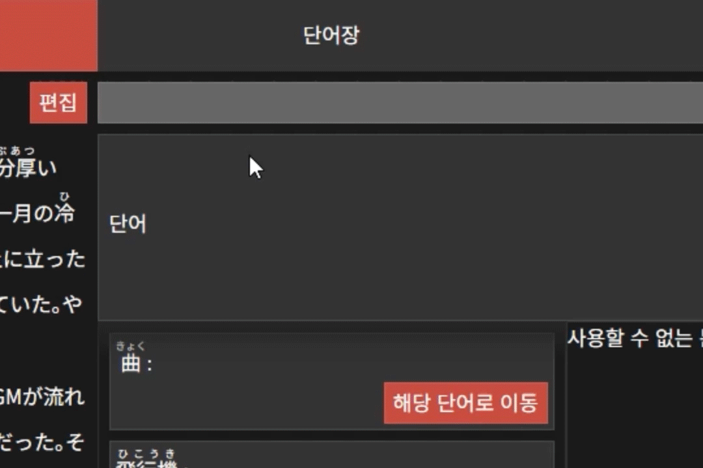
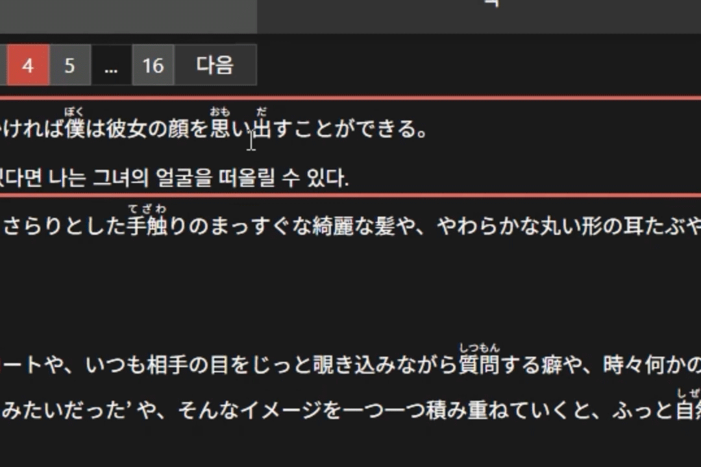
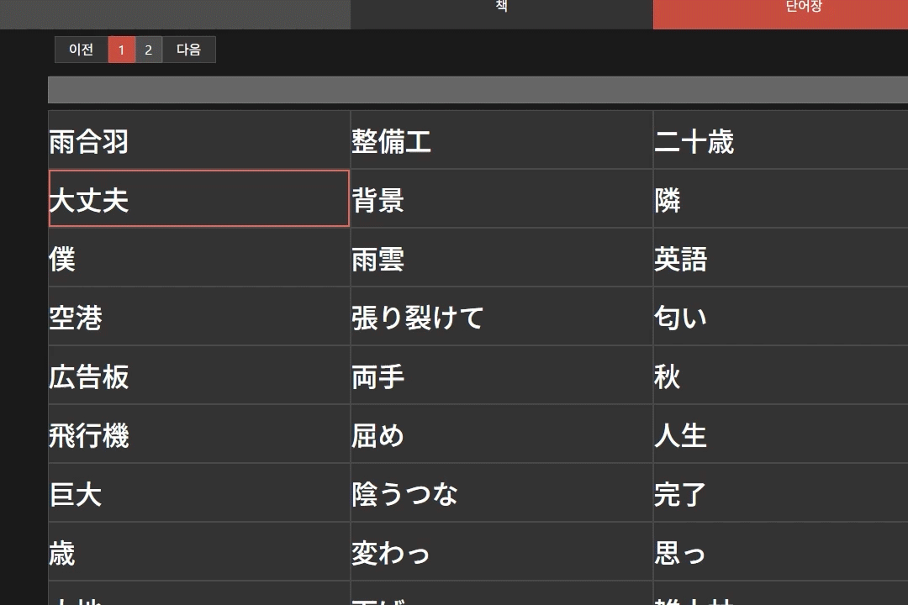

# OxxO

한국어 | [日本語](README-jpn.md)

 
 


## 목차

[프로젝트 소개](#프로젝트-소개)

[개발 배경](#개발-배경)

[프로젝트 구성](#프로젝트-구성)

[페이지 구성](#페이지-구성)

[폴더 구조](#폴더-구조)

[주요 기능](#주요-기능)

[부가 기능](#부가-기능)

[기능 소개](#기능-소개)

[개발자 소개](#개발자-소개)

[추가 개선 사항](#추가-개선-사항)

## 개발 환경

- Front-end
  - React, Typescript
  - scss
- back-end
  - NodeJS, Express.js
  - nodemailer, multer, OracleCloud
  - socket.io
- Database
  - OracleDB(AutonomousDatabase)

## 참조

- [JamesKyburz/youtube-audio-stream](https://github.com/JamesKyburz/youtube-audio-stream)
- [@distube/ytdl-core](https://github.com/distubejs/ytdl-core)
- [toss/es-hangul](https://github.com/toss/es-hangul)
- [오디오 파형 그리기 참조](https://blog.rhostem.com/posts/2022-01-08-canvas-web-audio-player)

# 프로젝트 소개

일본어 번역을 즐기는 사람을 위한 웹 어플리케이션

## 개발 배경

- 일본어를 번역하는데에 있어서, 기존의 문서 작업 프로그램으로는 아쉬운 부분을 충족하고자 개발.
- 기본적인 번역문 버전 관리, 단어를 **관계형 데이터베이스**로 저장해 이를 활용하는 기능을 추가하였습니다.
- 처음에는 개인 사용 목적으로 시작하였지만, 현재는 **공동작업**이 가능하게 프로젝트를 변경중에 있습니다.

일어일문학과 복수전공중, 일본어를 번역하는 과제를 하던중 기존의 문서작업으로는 아쉬운 점이 많다는 것을 깨달았습니다. 괜찮은 번역이 생각나면 휴대폰으로 그때그때 메모, 집에 돌아와서는 컴퓨터로 워드 문서 혹은 Adobe Indesign으로 정리하였으며, 이를 반복적으로 수행하는 중, 언제어디서나 접속해 문장을 저장할 수 있다면 편리하지 않을까 생각해 직접 개발하게되었습니다.
원문 한 문장에 대해 여러 문장을 써가며 더 좋은 문장을 찾을 수 있게 하는 것과, 만약 특정 단어의 번역을 변경하게 된다면, 검색을 통해 일괄적으로 놓치는 부분없이 번역이 가능하기를 우선적으로 바랬습니다. 단, 단어가 활용되는 경우나 단어자체에 여러 표기와 읽기가 혼재하는 일본어의 특성 상, word의 찾기/바꾸기 기능으로는 아쉬운 점이 존재하였습니다. 이를 조금 수고를 들여야 하지만 DB화해서 한 단어로 묶어 놓을 수 있다면 편하게 사용이 가능하지 않을까 해서, 일본어에 유리하게 단어 저장이 가능하도록 DB를 구성하였습니다. 또한 수고를 들여 저장한 단어를 활용 가능할 수 있는 방법을 모색 중에 단어장형식으로도 볼 수 있게 만들었습니다.

최종적으로, 사용자가 번역을 하면서 학습 혹은 개인적 성취감을 맛볼 수 있는 웹페이지로 기능할 수 있기를 바랍니다. 원서를 읽으며 자신만의 번역을 하거나, 단어장을 통해 해당 원서에 대해 이해도가 높아지기를 바랍니다. 또한 유튜브 영상에도 확장하여, 해당 영상에 대해 자막을 달고 이를 여러 사람이 공유하는 공간이 되기를 바라고 있습니다.

## 프로젝트 구성


문장에 단어를 등록 후, 해당 문장에 [단어 포함 관계 모듈]로 단어를 등록합니다. 단어를 등록하는 과정에서 [단어 DB 모듈]이 표기, 읽기를 판별해서 저장합니다. 표기와 읽기는 [단어 포함 관계 모듈]에 연결되어 저장되며, 표기, 읽기, 뜻은 모두 단어에 중복없이 저장됩니다. 또한 단어는 사용자 구분없이 통합적으로 관리됩니다.
[유튜브 모듈]은 youtube-audio-stream을 통해 ytdl-core로 추출된 유튜브 오디오 정보를 가져옵니다. 오디오 정보는 Canvas요소로 그려지게 됩니다.
웹소켓은 공동 작업을 가능하게 하며, 다른 사용자가 등록한 단어, 편집한 문장, 편집한 번역문의 업데이트 정보를 문장 단위로 업데이트합니다. 문장 편집은 한 사용자만 편집할 수 있게 관리되며, socket.io의 room으로 관리됩니다.

## 페이지 구성

- 로그인
- 회원가입
- 메인 페이지
  - 책 페이지
    - 책 편집
    - 단어장
    - 번역
  - 유튜브 페이지
    - 마킹
    - 타임라인
    - 번역

## 폴더 구조

### src

```
src
│  index.css
│  index.js
│  serviceWorker.js
│
├─@types
│      global.d.ts
│
├─client
│      index.d.ts
│      index.js
│      MainContext.js
│      MainContext.tsx
│      UserContext.js
│      UserContext.tsx
│
├─components
│      Accordian.js
│      Accordian.tsx
│      DropDown.js
│      DropDown.tsx
│      index.d.ts
│      index.js
│      Modal.js
│      Modal.tsx
│      Nav.js
│      Nav.tsx
│      Pagination.js
│      Pagination.tsx
│      StepPage.js
│      StepPage.tsx
│
├─pages
│  │  BookView.js
│  │  BookView.tsx
│  │  index.d.ts
│  │  index.js
│  │  MainComp.js
│  │  MainComp.tsx
│  │  SignPage.js
│  │  SignPage.tsx
│  │  TestPageComp.js
│  │  YoutubeView.js
│  │  YoutubeView.tsx
│  │
│  ├─BookModal
│  │      ModalEditHon.js
│  │      ModalEditHon.tsx
│  │      ModalNewHon.js
│  │      ModalNewHon.tsx
│  │
│  ├─BookViewComp
│  │      EditableHon.js
│  │      EditableHon.tsx
│  │      ExpComp.js
│  │      HonComp.js
│  │      HonComp.tsx
│  │      HonyakuComp.js
│  │      HonyakuComp.tsx
│  │      ImiComp.js
│  │      ImiComp.tsx
│  │      IndependentComp.js
│  │      IndependentComp.tsx
│  │      TangochouComp.js
│  │      TangochouComp.tsx
│  │      TangoComp.js
│  │      TangoComp.tsx
│  │
│  ├─YoutubeModal
│  │      ModalNewVideo.js
│  │      ModalNewVideo.tsx
│  │
│  └─YoutubeViewComp
│          AudioWaveComp.js
│          AudioWaveComp.tsx
│          SequenceView.js
│          SequenceView.tsx
│          TimeLineView.js
│          TimeLineView.tsx
│          YTHonyakuComp.js
│
├─shared
│  │  App.js
│  │
│  ├─bunModal
│  │      BunDBModal.js
│  │      BunDBModal.tsx
│  │      index.d.ts
│  │      index.js
│  │
│  ├─customComp
│  │      Bun.js
│  │      Bun.tsx
│  │      CompareBun.js
│  │      Dictionary.js
│  │      Dictionary.tsx
│  │      EditableBun.js
│  │      EditableBun.tsx
│  │      HonyakuBun.js
│  │      HonyakuBun.tsx
│  │      HukumuListComp.js
│  │      HukumuListComp.tsx
│  │      ImportComp.js
│  │      ImportComp.tsx
│  │      index.d.ts
│  │      index.js
│  │      OsusumeListComp.js
│  │      OsusumeListComp.tsx
│  │      SearchComp.js
│  │      SearchComp.tsx
│  │      TangoListComp.js
│  │      TangoListComp.tsx
│  │      Wrapper.js
│  │      Wrapper.tsx
│  │
│  └─hook
│          AxiosHook.js
│          HonHook.js
│          HonHook.tsx
│          HonyakuHook.js
│          HonyakuHook.tsx
│          Hook.js
│          Hook.tsx
│          HukumuListHook.js
│          HukumuListHook.tsx
│          index.d.ts
│          index.js
│          jaTextHook.js
│          jaTextHook.tsx
│          mobileHook.js
│          mobileHook.tsx
│          OptimizationHook.js
│          OptimizationHook.tsx
│          OsusumeHook.js
│          OsusumeHook.tsx
│          SelectionHook.js
│          SelectionHook.tsx
│          SocketHook.js
│          TangochouHook.js
│          TangochouHook.tsx
│          TangoListCompHook.js
│          TangoListCompHook.tsx
│          VideoPlayHook.js
│          VideoPlayHook.tsx
│
└─style
    │  MainComp.scss
    │  youtube-layout.scss
    │  _components.scss
    │  _layoutSize.scss
    │  _mediaquery.scss
    │  _testComp.scss
    │  _textStyle.scss
    │  _theme.scss
    │  _variables.scss
    │
    ├─customComp
    │      _Dictionary.scss
    │      _HonyakuBun.scss
    │      _HonyakuComp.scss
    │      _ImiComp.scss
    │      _TangoComp.scss
    │
    ├─modal
    │      EditHon.scss
    │      NewHon.scss
    │
    ├─modules
    │      _accordian.scss
    │      _button.scss
    │      _card.scss
    │      _dropDown.scss
    │      _input.scss
    │      _modal.scss
    │      _nav.scss
    │      _pagination.scss
    │      _searchComp.scss
    │
    └─page
        │  _bookView.scss
        │  _honLayout.scss
        │  _honyakuLayout.scss
        │  _signPage.scss
        │  _tangochouLayout.scss
        │  _youtubeView.scss
        │
        ├─BookView
        │      _HonComp.scss
        │      _TangochouComp.scss
        │
        └─YoutubeView
```

### server

```
server
│  server.js
│
├─asset
│  └─img
│
└─Router
    │  api.js
    │  bun.js
    │  exp_newHon.js
    │  grant.js
    │  hon.js
    │  hukumu.js
    │  image.js
    │  imi.js
    │  mail.js
    │  myUser.js
    │  socket.js
    │  tango.js
    │  translate.js
    │  yomi.js
    │  youtube.js
    │
    ├─dbCRUDModule
    │     db_bun.js
    │     db_core.js
    │     db_group.js
    │     db_hon.js
    │     db_hukumu.js
    │     db_medium.js
    │     db_tango.js
    │     db_translate.js
    │     db_user.js
    │     db_youtube.js
    │     index.js
    │
    │
    ├─dbModule
    │      db_bun.js
    │      db_error.js
    │      db_grant.js
    │      db_group.js
    │      db_hukumu.js
    │      db_hyouki.js
    │      db_imi.js
    │      db_invite.js
    │      db_kanji.js
    │      db_komu.js
    │      db_tango.js
    │      db_translate.js
    │      db_user.js
    │      db_userHukumu.js
    │      db_yomi.js
    │      db_youtube.js
    │      index.js
    │
    ├─db_conn
    │      dbconfig.js
    │      db_connection.js
    │
    ├─hon
    │      tangochou.js
    │
    └─youtube
            sequence.js
            timeline.js
            video.js
```

## 기능 개요

- 메인기능
  - 단어 DB 관리 기능
  - 번역 버전 관리 기능
  - 문장 검색 기능
  - 단어 검색 기능
- 서브 기능
  - 한글 -> 히라가나 변환 기능
  - 유튜브 문장 내보내기 기능

## 주요 기능

### 공통

#### 단어

문장을 드래그 해서 단어를 등록 할 수 있습니다. 현재 **한자** 또는 **한자 + 히라가나** 조합의 형태만 등록이 가능합니다.

한번 단어를 등록한 후에는, 등록된 단어를 드래그 시, 해당 표기를 기준으로 모든 문장이 검색됩니다. 검색된 문장을 통해 현재 등록된 단어정보로 바로 등록이 가능합니다. 또는, 드래그된 부분(단어가 등록되지 않은 경우)이 이미 등록된 단어의 표기가 있는 경우 바로 추가가능한 단어들이 목록에 표시됩니다.

단어 등록시에는, 읽기를 히라가나로만 입력해야 합니다. 현재 드래그 된 부분이 표기로 등록됩니다. 입력폼은 표기에 포함된 한자위에 input이 생성되며, 해당 부분에 표기에 있는 히라가나를 제외한 입력이 요구됩니다. 한글로 입력할 경우 자동으로 히라가나로 변환됩니다. 잘못 변경될 가능성이 있으므로, 확인 후 등록을 권장합니다.
새로 입력된 표기와 읽기로 중복된 단어가 없는 지 검색을 하며, 이미 등록된 단어에 저장할 수도 있습니다.

등록된 단어에는 뜻을 등록가능합니다. 단, 메모 용도로만 사용가능하며, 추후 활용방안을 모색하고 있습니다.

#### 번역

문장에 번역을 등록시, 새로 저장, 수정, 삭제의 기본적인 버전 관리가 가능합니다. 여러 개의 번역 중 하나만을 대표로 선택할 수 있습니다.

공동 작업시에는 권한(쓰기/읽기) 에 따라 **그룹 대표 표기**와 **개인 대표 표기**로 나뉩니다.

### 책

> [!NOTE]
> 모바일 화면과 태블릿 화면이 지원됩니다. 표시되는 레이아웃은 다를 수 있습니다.

원문을 등록해 번역할 수 있습니다.

단어를 등록해 단어장 형태로 볼 수 있으며, 해당 단어가 연결된 문장과 번역이 있는 경우 번역문을 보여줍니다.

> 단어장의 경우, 추후 pdf로 내보내기 등의 지원을 염두에 두고 있습니다.

### 유튜브

유튜브 링크를 등록해 번역할 수 있습니다.

> [!NOTE]
> 현재 유튜브 번역은 PC화면만 대응합니다. 또한 충분한 창 높이가 요구됩니다. 아직 유튜브에 지원은 불안정 합니다. 추후 업데이트 예정입니다.

시퀸스(Sequence)를 추가해서 타임라인을 생성합니다. 음성이 나오는 부분을 드래그해서 원문을 등록합니다.

> 오디오 파형을 가져오지 못하는 경우, **적당한 파형**이 표시됩니다.

> 타임라인을 내보내는 지원을 염두에 두고 있습니다. json 파일로 저장되며, 이를 읽어오는 script 및, mogrt의 표현식은 따로 리포지터리를 생성할 예정입니다.

> 유튜브 자막에 사용되는 형식으로의 내보내기도 지원할 예정입니다.

## 부가 기능

### 한글 -> 히라가나 변환 기능

웹페이지 이용시, 대체로 히라가나 입력이 필요한 단점이 존재. 이를 이용하기 위해, 사용자가 일본어 키보드를 설치해야하는 점과, 반복적인 키보드 전환이 사용에 있어서 불편함을 야기할 수 있기 때문에, 한글을 히라가나로 전환하는 기능을 추가하였습니다.

한글과 가장 가까운 히라가나로 맵핑하며, 장음은 '-'문자 또는 앞의 음에 맞게 변경합니다.

이 기능은 단어 등록시 **읽기 입력**, **문장 검색**, **단어장 검색**등의 기능에서 지원됩니다.

> toss/es-hangul의 getChosung부분을 참고해 변형하였습니다.

### 문장 내보내기 기능

> [!IMPORTANT]
> 유튜브에서 사용가능하며, 문장에 모든 단어가 등록되어야 원활히 작동합니다.

Adobe의 mogrt(모션 그래픽 템플릿) 파일에서 작동을 염두에 두고 만들었으며, 원문과 후리가나 문자열을 반환합니다.

이를 추후 배포 예정인 mogrt에 입력 시, 후리가나가 해당하는 한자위에 표시됩니다.

> [!CAUTION]
> 해당 일본어 폰트에서 전각 공백이 한자 한글자의 크기와 일치하는 폰트에서 원활히 표시 됩니다.

# 기능 소개

## 단어

### 단어를 새로 등록

단어를 드래그 해서 읽는 법을 입력한뒤, 등록 가능합니다. 입력은 해당 한자 위에 순서대로 나오며, 히라가나를 제외한 부분만 입력하셔야합니다.


### 등록된 단어가 있는 경우

해당 책에 같은 표기로 등록된 단어가 있는 경우 간편하게 추가할 수 있습니다.


### 등록된 단어를 드래그 해서 등록

등록된 단어의 모든 표기가 포함된 문장이 검색되며, 해당 문장으로 이동해서 확인하거나, 바로 추가가 가능합니다.


## 책 편집

책에 들어갈 문장을 추가할 수 있습니다. 단락 추가시에는 여러 단락을 한번에 추가할 수 있습니다. 문장 추가의 경우 해당 단락에 기준점 이후로 여러 문장을 한번에 추가할 수 있습니다.
추가 후에도 문장 편집이 가능합니다.


## 책 검색

검색어를 통해 문장을 검색해 해당 페이지로 이동할 수 있습니다. 단어가 등록된 경우에는 읽기로도 검색이 가능합니다.



## 번역

기본적인 문장 추가 및 수정, 버전관리가 가능합니다. 저장된 문장 중 대표로 표시한 문장을 선택할 수 있습니다.


등록된 단어의 뜻을 추가할 수 있습니다. 등록된 뜻은 새롭게 단어 등록 시 구별을 위해 쓰이며, 메모 용도입니다.



## 단어장

등록된 단어를 모아서 한 곳에서 볼 수 있습니다. 단어장에는 해당 단어가 등록된 문장, 번역을 볼 수 있습니다. 또한 해당 단어에 여러 표기가 등록된 경우는 표기로 분류해서 보여줍니다. 단어의 한자를 클릭하면 해당 한자가 포함된 단어가 표시되며, 클릭 시 각 단어로 이동가능합니다.



단어장을 검색할 수 있습니다. 읽는 법으로도 검색이 가능합니다.


## 유튜브


# 개발자 소개

백엔드 및 프론트, DB구성을 담당하였습니다.

- 2017.03 ~ 2024.02 숭실대학교 소프트웨어학부 졸업 (복수전공 : 일어일문학과)

# 추가 개선 사항

- 페이지 일본어 지원
- 유튜브 번역 페이지 안정화
- 초대 및 공유 기능 구현 안정화
- mogrt형식 내보내기 기능 활성화
- 단어 뜻 활용 방안 모색
- 번역이 완료된 유튜브 영상 공유 기능 추가
- 단어장 pdf 내보내기 기능
- 웹소켓 동작 안정화
- 권한 별 번역문 기능 세분화
- 유튜브 마킹 페이지 유저 편의성 강화
- 일본어 -> 한글 변환 안정화
